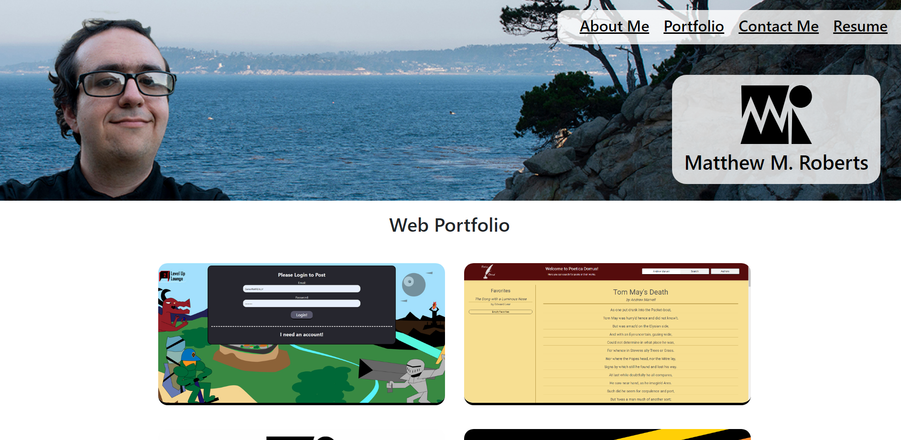

# Web Portfolio

## Description

This is my Web Portfolio Site! It contains contact information, information about me, and several of my web projects. It is written with HTML, CSS, JS and operates with React.

## Usage

The page can be found online through the following url: https://dainty-selkie-5699ce.netlify.app/About
Click on the nav bar items at the top to change the page! Mouse over projects to get links to their deployed link or github link. Click on the icons on the footer to go to my different platforms.

## Credits

UC Berkeley

## License

MIT License